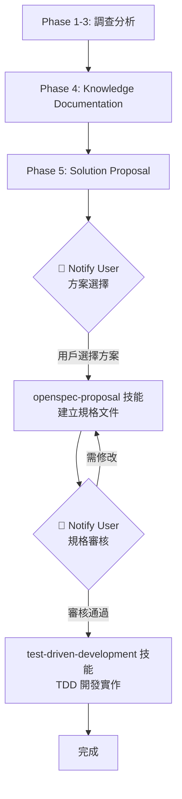

# Bug Investigation Skill

一個系統化調查軟體缺陷的 AI agent 技能，提供結構化的方法論和專業工具支援。

## 📋 概述

Bug Investigation Skill 實現了 5 階段的調查方法論：
1. **Problem Discovery** - 理解問題本質
2. **Evidence Gathering** - 收集資料庫和日誌證據
3. **Root Cause Analysis** - 追蹤資料流找出根因
4. **Knowledge Documentation** - 記錄調查結果供未來參考
5. **Solution Proposal** - 設計修復方案並與其他技能串接

> **技能串接**：此技能與 `openspec-proposal`（規格建立）和 `test-driven-development`（TDD 開發）技能整合，形成完整的調查→規劃→開發流程。

## 🎯 適用情境

- Bug 報告描述非預期行為
- 預期資料與實際資料不一致
- 需要追蹤問題穿越多個系統層級（前端/後端/資料庫）
- 調查需要資料庫證據收集和 SQL 查詢
- 需要為團隊建立知識文件
- 資料同步或狀態管理問題

## 📁 技能結構

```
bug-investigation/
├── SKILL.md                    # 技能主檔案（5階段方法論）
├── README.md                   # 本檔案
├── LICENSE                     # MIT 授權
├── .gitignore                  # Git 忽略規則
├── references/                 # 參考文件
│   └── checklist.md           # 完整調查檢查清單
├── scripts/                    # 調查工具腳本
│   ├── README.md              # 腳本詳細說明
│   ├── check-tools.sh         # 檢查必要工具
│   ├── trace-data-flow.sh     # 追蹤資料流
│   ├── search-database-queries.sh  # 搜尋 SQL 查詢
│   ├── analyze-function-calls.sh   # 分析函數呼叫
│   └── generate-flow-diagram.sh    # 生成流程圖
└── examples/                   # 調查案例範例
    ├── README.md
    └── data-flow-example/     # 完整調查範例
        └── investigation.md
```

## 🚀 快速開始

### 1. 查看技能內容

```bash
# 閱讀主要技能檔案
cat SKILL.md

# 查看可用腳本
ls -la scripts/
cat scripts/README.md
```

### 2. 檢查必要工具

```bash
cd scripts
./check-tools.sh
```

必要工具包括：
- **ripgrep** (rg) - 程式碼搜尋 ⭐⭐⭐
- **fd** - 檔案搜尋 ⭐⭐
- **ast-grep** - AST 分析 ⭐⭐
- **jq** / **yq** - 資料處理 ⭐

### 3. 使用範例

當您需要調查 bug 時，向 AI 助手提供：

```
請使用 Bug Investigation skill 調查 [功能名稱] 的 [問題描述]

重現步驟：
1. [步驟 1]
2. [步驟 2]
3. [步驟 3]

預期結果：[描述]
實際結果：[描述]
相關資料：[Transaction ID / Order No 等]
```

## 🔄 調查流程與技能串接



### 關鍵檢查點

| 階段 | 動作 | 產出 |
|------|------|------|
| Phase 4 完成後 | 自動進入 Phase 5 | `docs/knowledge/[feature-name]/` 文件 |
| Phase 5.2 完成後 | 🔔 `notify_user` | 方案選項，等待用戶選擇 |
| Phase 5.4 完成後 | 🔔 `notify_user` | OpenSpec Proposal，等待審核 |
| 審核通過後 | 切換至 TDD 技能 | 依規格進行開發 |

## 📖 核心功能

### 1. 系統化調查方法論

遵循結構化的 5 階段流程（詳見 [SKILL.md](SKILL.md)）：
- Phase 1: Problem Discovery
- Phase 2: Evidence Gathering  
- Phase 3: Root Cause Analysis
- Phase 4: Knowledge Documentation
- Phase 5: Solution Proposal

完整檢查清單：[references/checklist.md](references/checklist.md)

### 2. 專業工具支援

提供 5 個腳本工具協助調查：
- **資料流追蹤** - 追蹤變數在系統中的流向
- **SQL 查詢搜尋** - 尋找資料表相關操作
- **函數呼叫分析** - 分析程式碼依賴關係
- **流程圖生成** - 產生 Mermaid 圖表
- **工具檢查** - 驗證環境設定

詳細說明：[scripts/README.md](scripts/README.md)

### 3. 知識管理

調查結果儲存到專案內部知識庫（**非 AI 工具的 artifacts 目錄**）：

```
專案根目錄/
└── docs/knowledge/
    └── [feature-name]/
        ├── brainstorming.md   # 調查文件
        ├── data-flow.md       # 資料流分析
        ├── key-functions.md   # 關鍵函數
        └── related-tables.md  # 相關資料表
```

**好處**：
- 與程式碼一同版本控制
- 團隊成員共享調查結果
- 對話結束後依然可存取
- 減少重複的 code tracing
- 累積專案知識資產

### 4. 完整範例

查看 [examples/data-flow-example/](examples/data-flow-example/) 了解完整的調查流程，包含：
- 問題描述與重現步驟
- 資料流追蹤過程
- Mermaid 流向圖
- 根因分析
- 解決方案

## 🎓 使用最佳實踐

1. **清晰描述問題** - 提供具體錯誤訊息和重現步驟
2. **提供樣本資料** - 包含 ID、時間戳記等可追蹤資訊
3. **使用專業工具** - 善用 ripgrep、fd、ast-grep 加速調查
4. **記錄調查過程** - 所有發現都應文件化
5. **建立知識庫** - 將結果儲存到專案內部 `docs/knowledge/`
6. **使用視覺化** - 複雜流程用 Mermaid 圖表呈現

## 🔧 技能設計原則

符合 [skill-creator](https://github.com/anthropics/claude-skills/tree/main/skill-creator) 規範：

- ✅ **清晰的 YAML frontmatter** - 明確的 name 和 description（含觸發情境）
- ✅ **漸進式揭露** - 從元資料 → SKILL.md → references → 腳本資源
- ✅ **SKILL.md 精簡** - 低於 500 行，詳細內容移至 references
- ✅ **腳本可重用** - 通用化設計，不綁定特定專案
- ✅ **技能串接** - 與 openspec-proposal、test-driven-development 整合

## 🤝 貢獻

歡迎改進此技能！

1. Fork 此專案
2. 創建特性分支 (`git checkout -b feature/AmazingFeature`)
3. 提交變更 (`git commit -m 'Add AmazingFeature'`)
4. 推送分支 (`git push origin feature/AmazingFeature`)
5. 開啟 Pull Request

## 📄 授權

此專案採用 MIT 授權條款 - 詳見 [LICENSE](LICENSE) 檔案

## 🔗 相關資源

- [SKILL.md](SKILL.md) - 完整的調查方法論
- [references/checklist.md](references/checklist.md) - 調查檢查清單
- [scripts/README.md](scripts/README.md) - 腳本工具說明
- [examples/](examples/) - 調查案例範例
- [Skill Creator](https://github.com/anthropics/awesome-claude-skills/tree/main/skill-creator) - 技能創建指南
- [Mermaid 官方文件](https://mermaid.js.org/) - 圖表語法

---

**This skill is designed for AI coding assistants** (Antigravity, Claude, Cursor, etc.) **to systematically investigate bugs using professional tools and structured methodology.**
